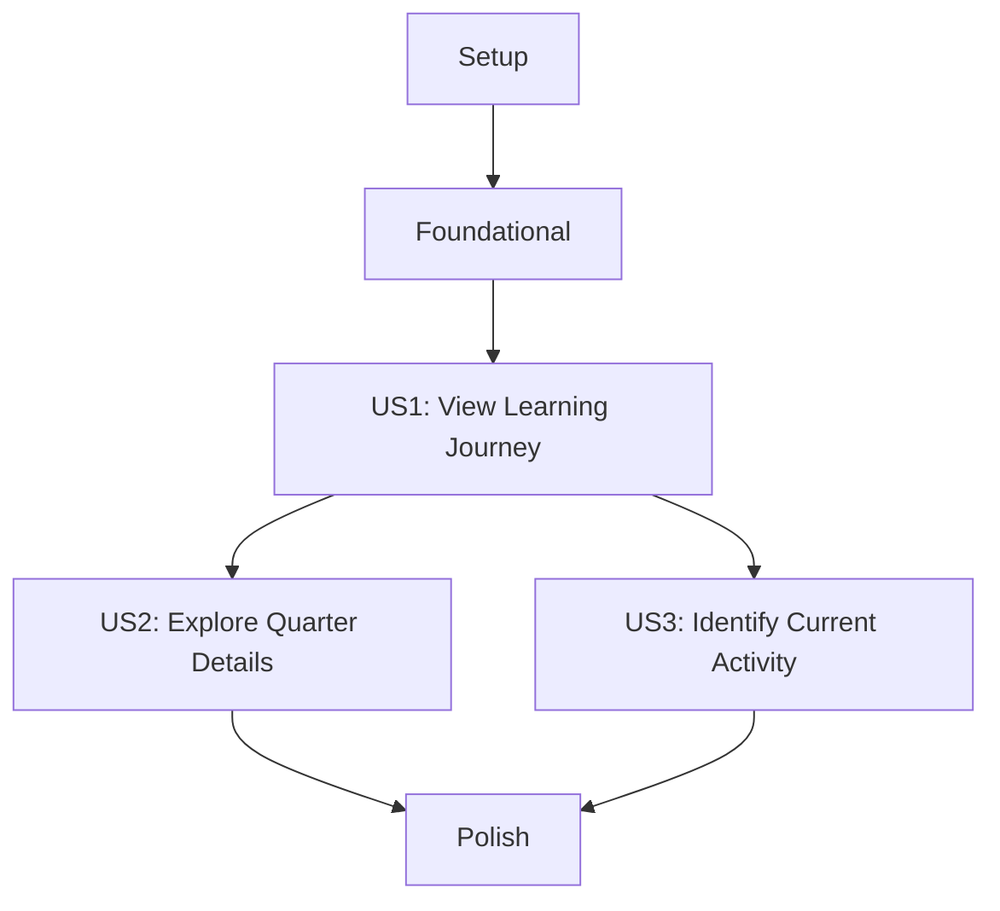

# Tasks: S-11 / Timeline Section

**Feature Name**: `011-timeline-section` | **Spec**: [specs/011-timeline-section/spec.md] | **Plan**: [specs/011-timeline-section/plan.md]

## Implementation Strategy

We will implement the Timeline Section incrementally, starting with the data layer and moving through the visual structure, interactive elements, and finally the animations. We strictly follow the "one expanded card at a time" rule and ensure full accessibility and reduced motion support from the start.

## Dependency Graph

## Phase 1: Setup

- [ ] T001 [P] Create the component shell in `frontend/components/sections/timeline-section.tsx`
- [ ] T002 [P] Export the component from `frontend/components/sections/index.ts`

## Phase 2: Foundational

- [ ] T003 Define `TimelineEvent` interface and `timelineData` constant in `frontend/components/sections/timeline-section.tsx`
- [ ] T004 [P] Define animation variants (`fadeUpVariant`, `slideInLeft`, `slideInRight`, `hoverVariant`) at module level in `frontend/components/sections/timeline-section.tsx`

## Phase 3: [US1] View Learning Journey

**Goal**: Render a chronological vertical timeline with 4 nodes alternating on desktop and left-aligned on mobile.

- [ ] T005 [US1] Implement the section wrapper with ID "timeline" and py-terminal-xl padding in `frontend/components/sections/timeline-section.tsx`
- [ ] T006 [US1] Implement section heading using `@skill/section-heading` pattern with name "journey" in `frontend/components/sections/timeline-section.tsx`
- [ ] T007 [US1] Implement the relative container and absolute vertical spine in `frontend/components/sections/timeline-section.tsx`
- [ ] T008 [US1] Map through `timelineData` to render nodes with dots on the spine in `frontend/components/sections/timeline-section.tsx`
- [ ] T009 [US1] Implement alternating layout for nodes (even index left, odd index right) on desktop in `frontend/components/sections/timeline-section.tsx`
- [ ] T010 [US1] Render static card content (quarter, period, title) for each node in `frontend/components/sections/timeline-section.tsx`
- [ ] T011 [US1] Implement skills badges for each card using the `Badge` component in `frontend/components/sections/timeline-section.tsx`

## Phase 4: [US2] Explore Quarter Details

**Goal**: Implement the expand/collapse interaction for cards, ensuring only one is open at a time.

- [ ] T012 [US2] Implement `expandedIndex` state and toggle logic in `frontend/components/sections/timeline-section.tsx`
- [ ] T013 [US2] Wrap detailed content (description, highlights) in `AnimatePresence` and `motion.div` for height transitions in `frontend/components/sections/timeline-section.tsx`
- [ ] T014 [US2] Render highlights list with "▸" prefix and terminal-xs styling in `frontend/components/sections/timeline-section.tsx`
- [ ] T015 [US2] Implement the "[+ expand]" / "[- collapse]" toggle button with proper touch target in `frontend/components/sections/timeline-section.tsx`

## Phase 5: [US3] Identify Current Activity

**Goal**: Add visual highlights to the Q4 (active) quarter node.

- [ ] T016 [US3] Apply active badge `[active ▶]` with `animate-glow-pulse` class to the Q4 node in `frontend/components/sections/timeline-section.tsx`
- [ ] T017 [US3] Apply green left border accent and terminal shadow to the Q4 card in `frontend/components/sections/timeline-section.tsx`
- [ ] T018 [US3] Ensure active pulse animation is disabled when `prefers-reduced-motion` is true in `frontend/components/sections/timeline-section.tsx`

## Phase 6: Polish & Cross-Cutting

- [ ] T019 Implement scroll animations (`whileInView`) for nodes using `slideInLeft`/`slideInRight` variants in `frontend/components/sections/timeline-section.tsx`
- [ ] T020 Integrate `useReducedMotion()` and apply the "no animation" conditional to all motion components in `frontend/components/sections/timeline-section.tsx`
- [ ] T021 Perform ARIA audit: Add `aria-expanded`, `aria-controls`, and `aria-hidden` to appropriate elements in `frontend/components/sections/timeline-section.tsx`

## Phase 7: Verification

- [ ] T022 Run TypeScript verification: `cd frontend && npx tsc --noEmit`
- [ ] T023 Verify responsive behavior: spine and dots align correctly on 320px, 768px, and 1440px widths.
- [ ] T024 Verify interaction: only one card can be expanded at a time; clicking a new card collapses the old one.
- [ ] T025 Verify reduced motion: animations are entirely skipped when `prefers-reduced-motion` is enabled.

---

## TASK DETAILS

### TASK-1: Define TimelineEvent interface
File: `frontend/components/sections/timeline-section.tsx`
Change: Define the interface as per spec.
Done: Interface typed with 7 fields, status union 'completed'|'active', variant union 'green'|'cyan', tsc accepts with 0 errors.

### TASK-2: Define timelineData constant
File: `frontend/components/sections/timeline-section.tsx`
Change: Populate the constant with all 4 quarters from the spec.
Done: Defined at module level, typed as `TimelineEvent[]`, tsc accepts with 0 errors.

### TASK-3: Define fadeUpVariant at module level
File: `frontend/components/sections/timeline-section.tsx`
Change: Implement `fadeUpVariant` matching `@skill/framer-animation`.
Done: Matches spec exactly: `hidden: { opacity: 0, y: 20 }, visible: { opacity: 1, y: 0, transition: { duration: 0.5, ease: 'easeOut' } }`.

### TASK-4: Define slideInLeft variant at module level
File: `frontend/components/sections/timeline-section.tsx`
Change: Implement `slideInLeft` for even nodes.
Done: `hidden: { opacity: 0, x: -30 }, visible: { opacity: 1, x: 0, transition: { duration: 0.5, ease: 'easeOut' } }`.

### TASK-5: Define slideInRight variant at module level
File: `frontend/components/sections/timeline-section.tsx`
Change: Implement `slideInRight` for odd nodes.
Done: `hidden: { opacity: 0, x: 30 }, visible: { opacity: 1, x: 0, transition: { duration: 0.5, ease: 'easeOut' } }`.

### TASK-6: Implement TimelineSection shell
File: `frontend/components/sections/timeline-section.tsx`
Change: Create the 'use client' component with standard wrapper.
Done: 'use client' directive on line 1, id="timeline" on section element, py-terminal-xl (maps to 96px / 6rem from S-2 spacing tokens) vertical padding, PageWrapper wrapping all content, overflow-x-hidden on section element.
Verify: computed padding-top and padding-bottom = 96px in DevTools.

### TASK-7: Implement section heading
File: `frontend/components/sections/timeline-section.tsx`
Change: Apply `@skill/section-heading` pattern.
Done: '// section' comment, 'journey' h2, 60px green bar, `fadeUpVariant` applied.

### TASK-8: Implement timeline container + spine
File: `frontend/components/sections/timeline-section.tsx`
Change: Render the visual spine line.
Done: `relative` container, absolute spine 2px width, desktop `left: 50%`, mobile `left: 20px`.

### TASK-9: Implement node alternating layout
File: `frontend/components/sections/timeline-section.tsx`
Change: Use index to alternate node sides.
Done: `even index -> left side desktop`, `odd index -> right side desktop`, all right on mobile.

### TASK-10: Implement connector dot
File: `frontend/components/sections/timeline-section.tsx`
Change: Render the circle on the spine for each event.
Done: `w-4 h-4` circle, color matches `event.variant`, `aria-hidden="true"`.

### TASK-11: Implement active pulse ring on Q4 dot
File: `frontend/components/sections/timeline-section.tsx`
Change: Add pulsing ring behind the Q4 dot.
Done: Extra span behind dot, `animate-glow-pulse` class, hidden when `useReducedMotion()` is true.

### TASK-12: Implement quarter label + period
File: `frontend/components/sections/timeline-section.tsx`
Change: Render '[Q1]' and date range.
Done: `font-mono bold` variant color, period in `muted terminal-xs`.

### TASK-13: Implement card shell
File: `frontend/components/sections/timeline-section.tsx`
Change: Create the base card container for each node.
Done: `bg-dark-surface` border, `rounded-terminal-lg p-6`, hover border color transition.

### TASK-14: Implement Q4 active card treatment
File: `frontend/components/sections/timeline-section.tsx`
Change: Apply active styling to Q4 card.
Done: `border-l-4 border-l-dark-green`, `shadow-terminal-green`.

### TASK-15: Implement card title + status badge
File: `frontend/components/sections/timeline-section.tsx`
Change: Render title and status indicator.
Done: `<h3>` in `font-mono terminal-lg`, `[completed]` or `[active ▶]` badge.

### TASK-16: Implement skills badges in card
File: `frontend/components/sections/timeline-section.tsx`
Change: Render tech stack as badges.
Done: `Badge` component from `@/components/ui`, `event.variant` as variant, `size="sm"`.

### TASK-17: Implement expandedIndex state
File: `frontend/components/sections/timeline-section.tsx`
Change: Add `useState` for expansion control.
Done: `useState<number | null>(null)`, toggle function ensuring only one is open.

### TASK-18: Implement collapsible content wrapper
File: `frontend/components/sections/timeline-section.tsx`
Change: Use `AnimatePresence` and `motion.div` for transitions.
Done: `height 0->auto`, `opacity 0->1`, 0.3s duration, instant when `useReducedMotion()` is true.

### TASK-19: Implement description paragraph
File: `frontend/components/sections/timeline-section.tsx`
Change: Render the event description.
Done: `font-sans terminal-sm leading-relaxed`, muted color.

### TASK-20: Implement highlights list
File: `frontend/components/sections/timeline-section.tsx`
Change: Render achievement bullets.
Done: '▸ ' prefix span aria-hidden="true" styled font-mono terminal-xs variant-color, item text font-sans terminal-xs muted-color, gap-1 between items. Rationale: split styling follows Constitution Pillar III (UI chrome vs descriptive content).

### TASK-21: Implement expand/collapse toggle button
File: `frontend/components/sections/timeline-section.tsx`
Change: Add interactive text trigger.
Done: `[+ expand]` / `[- collapse]` text, `py-3` minimum touch target, `cursor-pointer`.

### TASK-22: Apply aria-expanded + aria-controls
File: `frontend/components/sections/timeline-section.tsx`
Change: Connect button and panel for screen readers.
Done: `aria-expanded={isExpanded}` on button, `aria-controls` matching panel ID.

### TASK-23: Implement scroll animations on nodes
File: `frontend/components/sections/timeline-section.tsx`
Change: Apply `whileInView` entry animations.
Done: `slideInLeft` (even), `slideInRight` (odd), `fadeUpVariant` (mobile), `once: true`, `margin: '-80px'`.

### TASK-24: Apply all ARIA attributes
File: `frontend/components/sections/timeline-section.tsx`
Change: Final audit of accessibility props.
Done: `aria-hidden` on decorative elements (dots, prefixes).

### TASK-24a: Implement and verify keyboard navigation
File: `frontend/components/sections/timeline-section.tsx`
Done:
- Toggle is a <button> element ✓
- Tab reaches all 4 quarter toggles ✓
- Enter + Space both toggle expand/collapse ✓
- Focus stays on button after toggle ✓
- Focus ring visible in both themes ✓
- No Escape handler present ✓

### TASK-25: Update sections barrel export
File: `frontend/components/sections/index.ts`
Change: Add `TimelineSection` to barrel.
Done: Exported as `TimelineSection`.

### TASK-26: TypeScript verification
Command: `cd frontend && npx tsc --noEmit`
Done: EXACTLY 0 TypeScript errors.

### TASK-27: Visual + interaction verification
Verification: SC-001 through SC-017 confirmed.
Done: Q4 glow visible, toggle button >= 44px, one card open at a time, no horizontal scroll.
